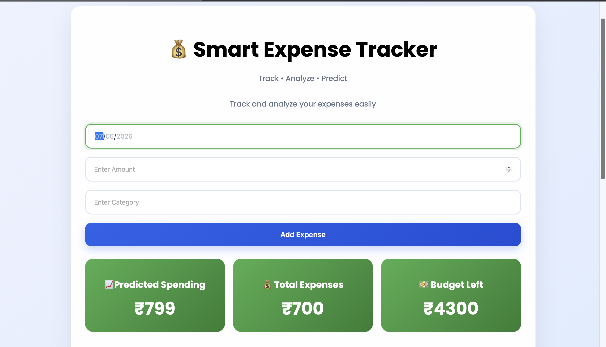
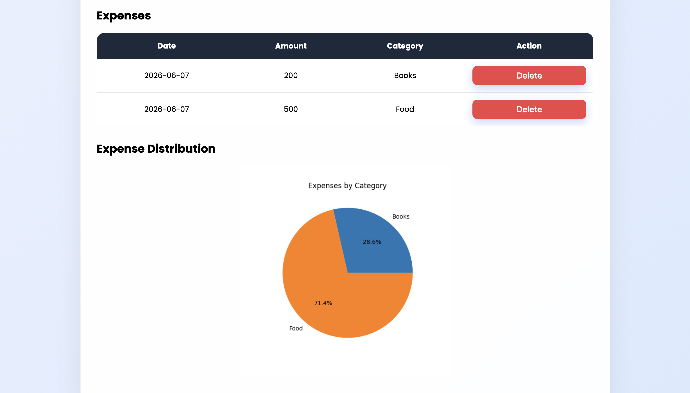

# Smart Expense Tracker

A Flask-based expense tracking web application with analytics and spending prediction.

## Dashboard

## Expense Analytics

## Features

- Add Expenses
- Delete Expenses
- Budget Tracking
- Expense Distribution Pie Chart
- Spending Prediction using Linear Regression